# IOT Hackday Gallery

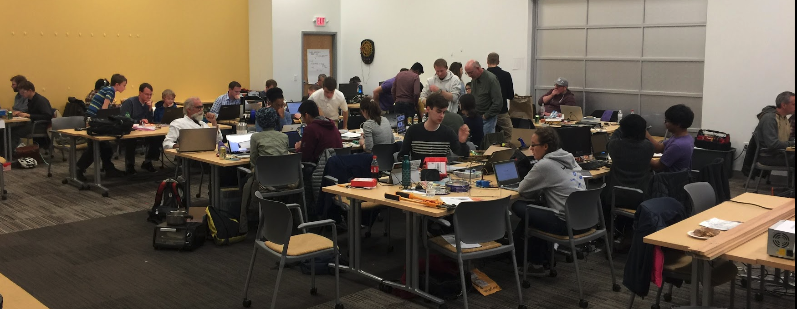

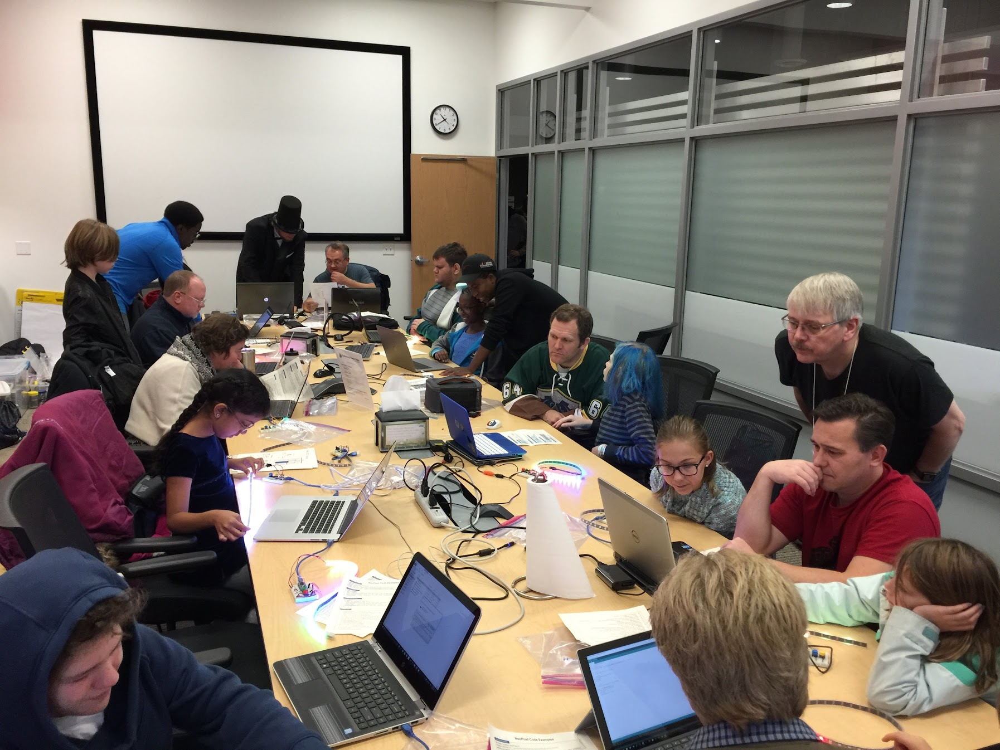

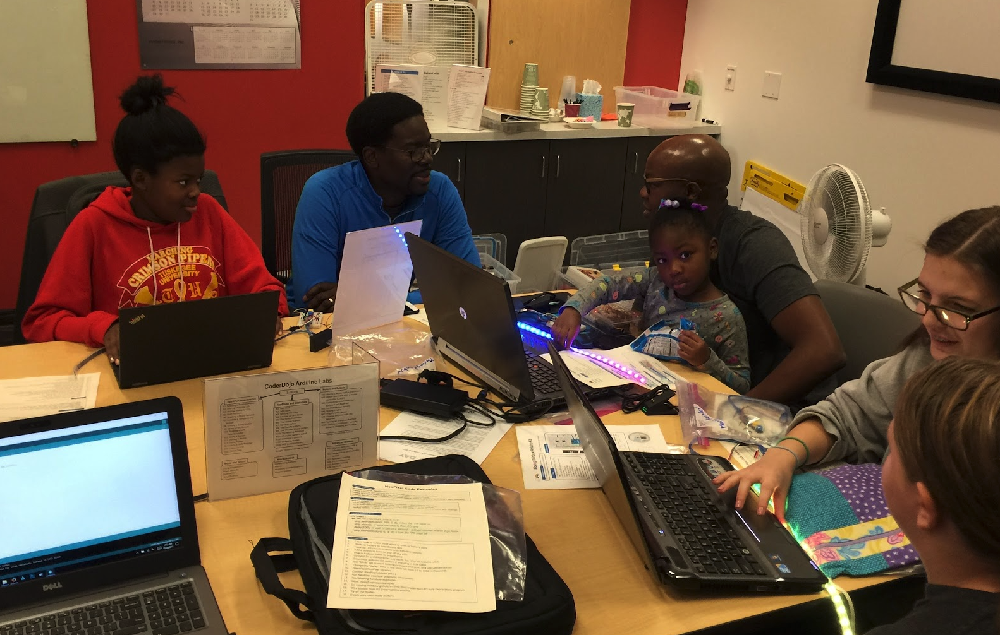

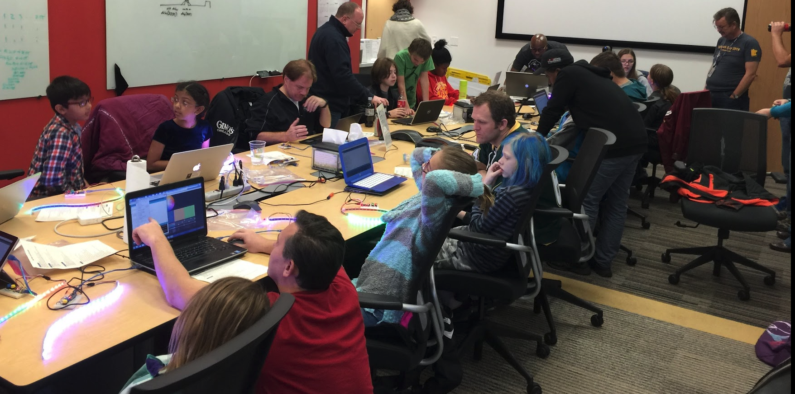

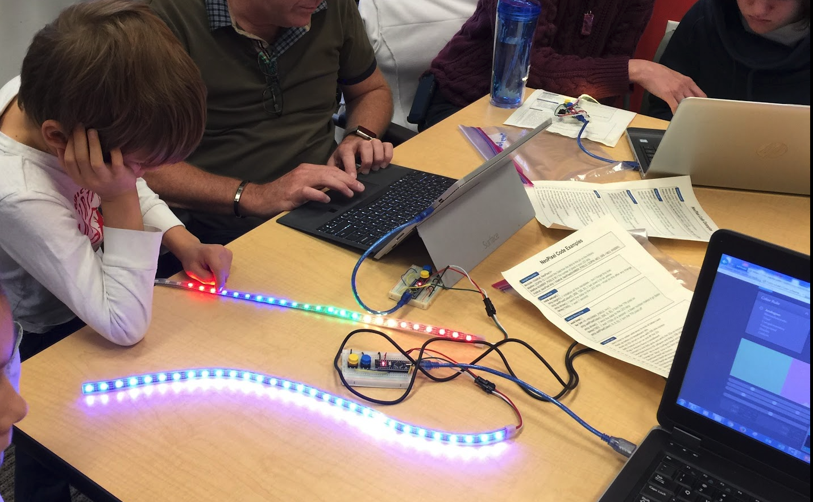
Getting these LEDs to light up in unique patterns is fun!

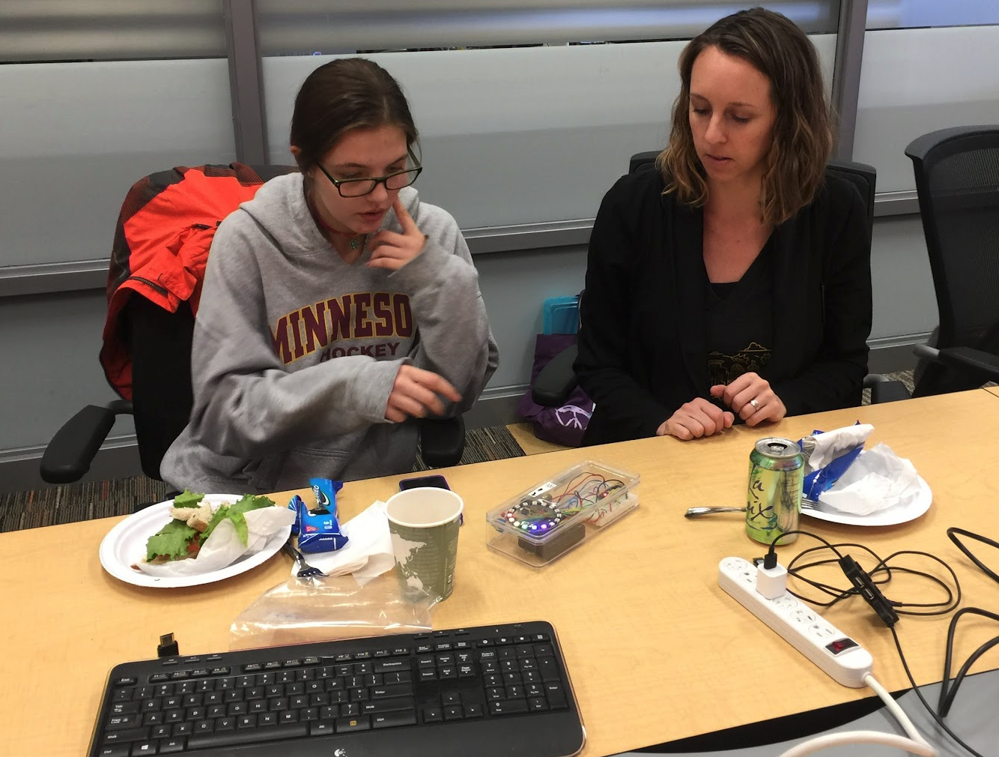

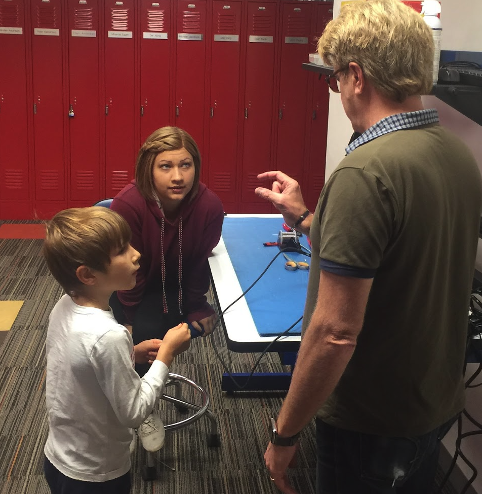

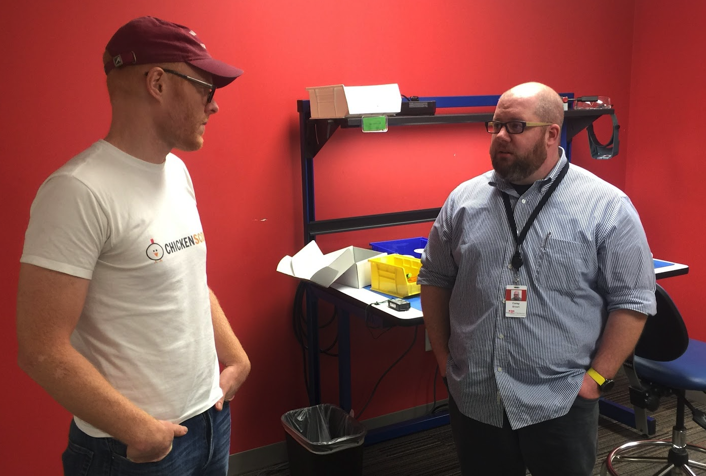

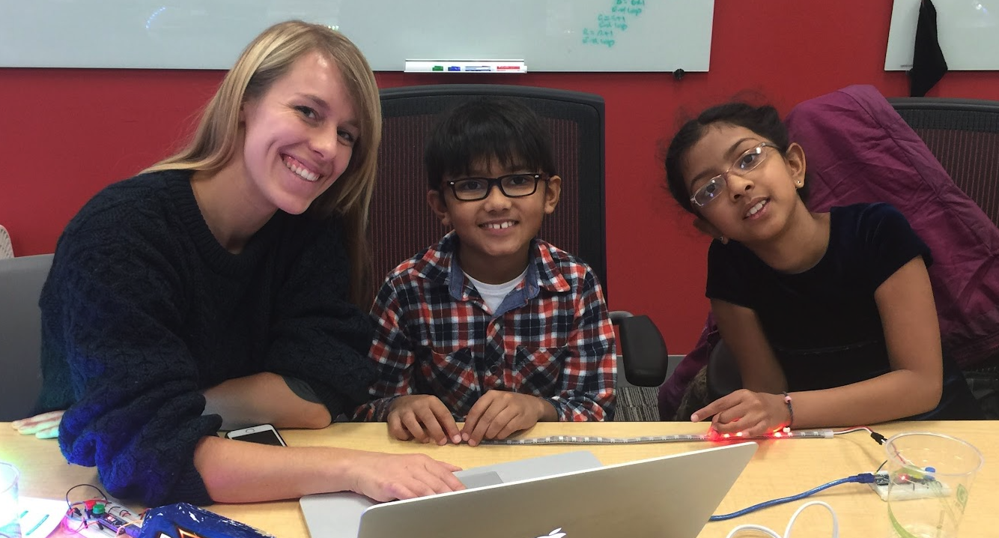

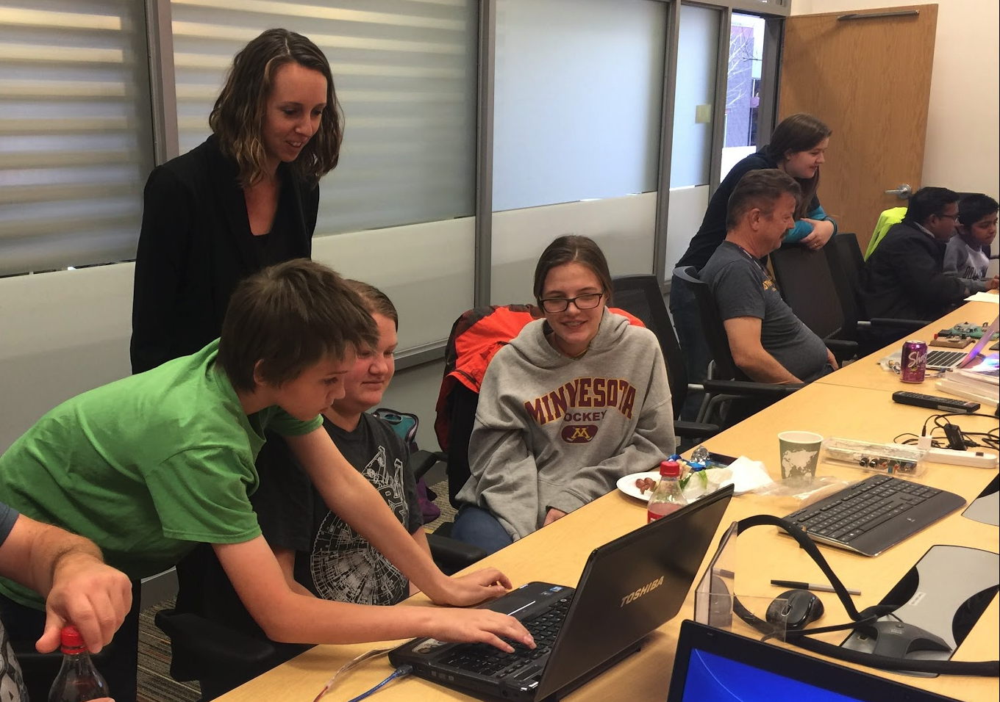

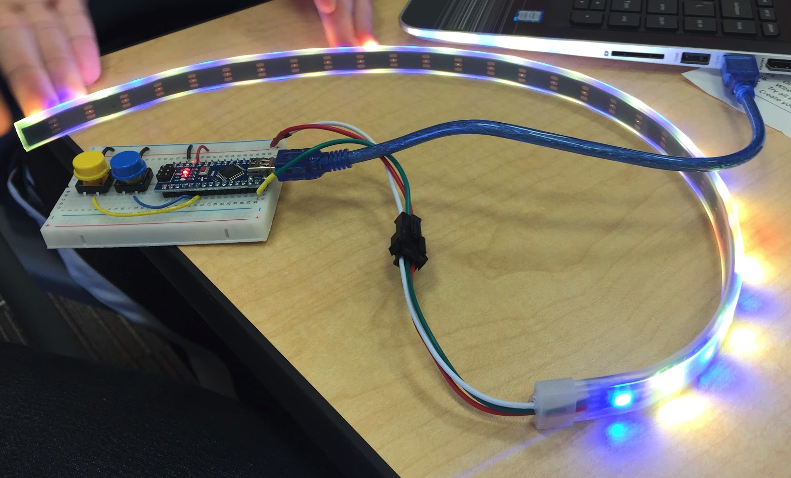

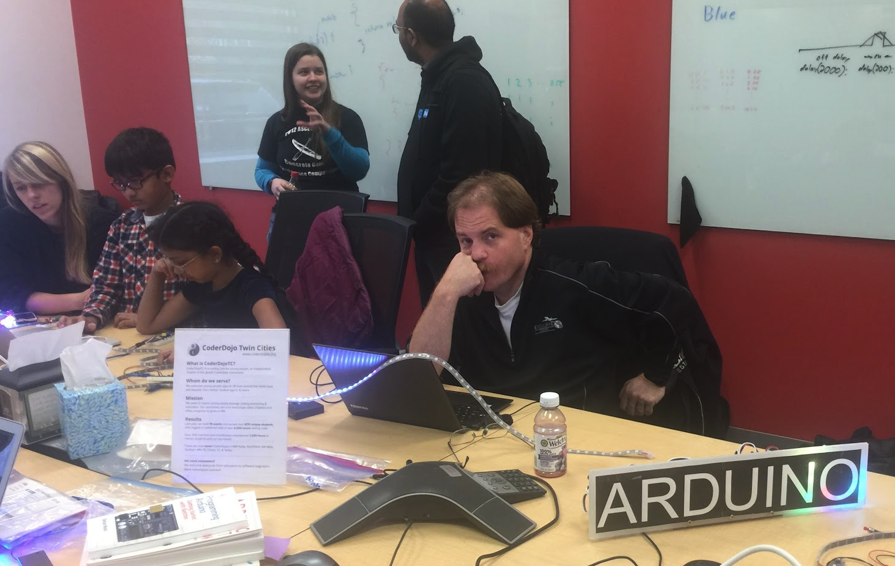

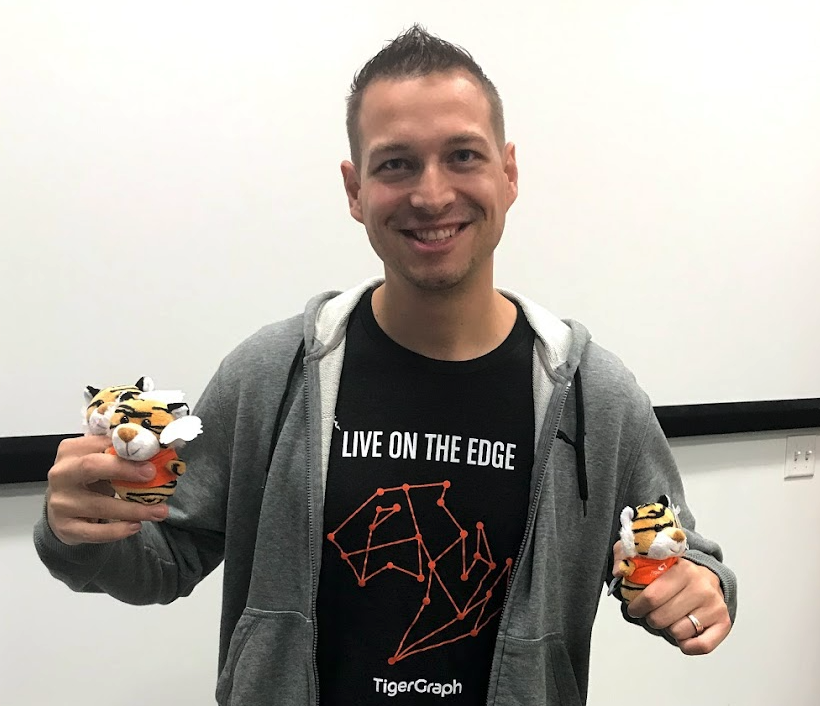
Jon Herke from our 2019 Hackathon.

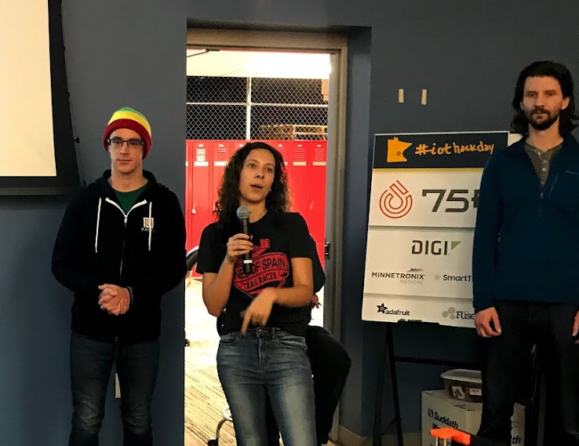
Our 2019 Judges.

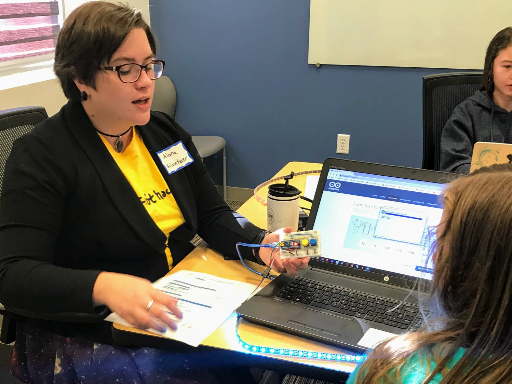
Alona teaching students how to light up the LEDs strips.