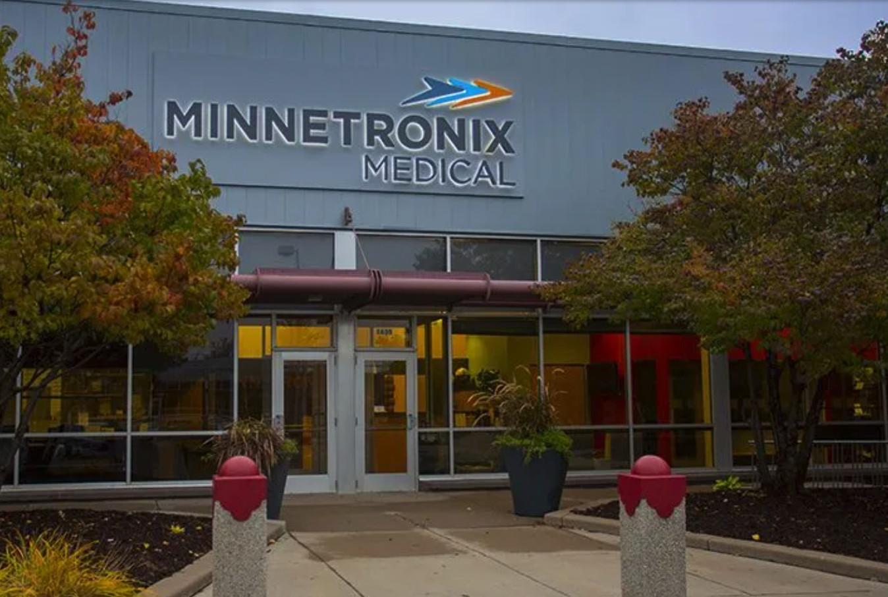

# IoT Hackday 2023 Is Almost Here!

## Event Date

<b>Saturday, October 7th, 2023 8 am to 6 pm</b>

The Hackday starts in: 

<a href="https://www.eventbrite.com/e/code-savvy-iot-hackday-tickets-692503896797" class="register-button" style="color:white">Register on EventBright</a>

After you register on the EventBrite site we will notify you about matching participants with teams and registering your team.  Please sign up now so we can send you notifications about our team planning events.

## Themes for 2023

* Women in IoT
* IoT and STEM in School Curriculum
* Sustainability Projects
* Low-cost IoT MicroPython devices such as the [$6 Raspberry Pi Pico W](https://www.raspberrypi.com/news/raspberry-pi-pico-w-your-6-iot-platform/).
* Integration of low-cost [LED Fairy Lights](https://www.amazon.com/ALOVECO-Changing-Christmas-Halloween-Decorative/dp/B08TBF3DJJ) into costumes and devices

## Location

We are happy to be hosted at the same location as in our prior years.

* Minnetronix
* Energy Park in St. Paul MN
* 1635 Energy Park Dr, St Paul, MN 55108

